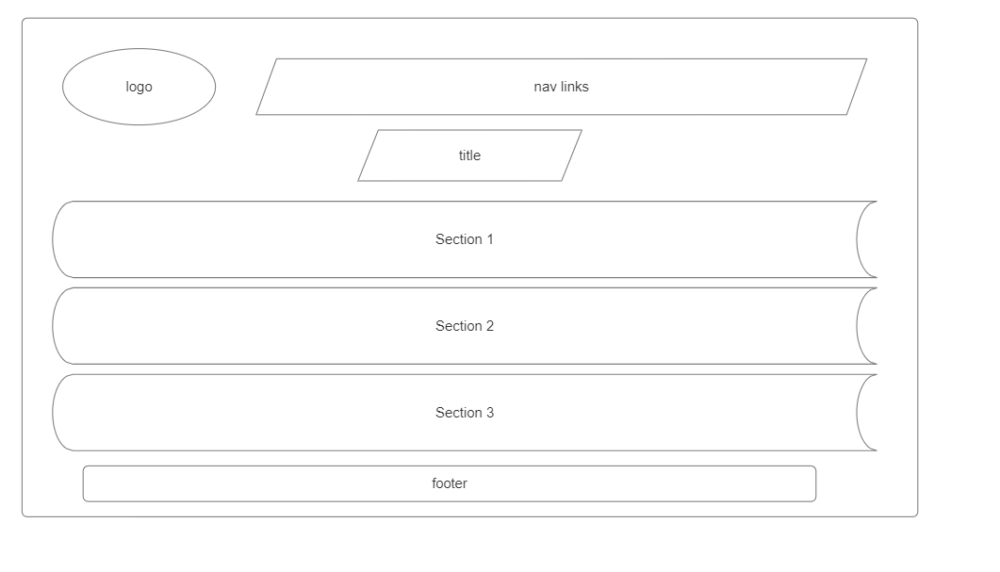

# Name of project

HYF Redesign

> A passionate and diverse community aim to enable refugees and disadvantaged
> people to build digital skills for a career in web development, facilitate the
> integration of newcomers, and address the shortage of qualified workforce in
> the IT sector.

## Table of contents

- [Name of project](#name-of-project)
  - [Table of contents](#table-of-contents)
  - [General info](#general-info)
  - [Screenshots](#screenshots)
  - [Technologies](#technologies)
  - [Setup](#setup)
  - [Code Examples](#code-examples)
  - [Features](#features)
  - [Status](#status)
  - [Inspiration](#inspiration)
  - [Contact](#contact)
  - [Instructions for use](#instructions-for-use)
  - [Code Quality Checks](#code-quality-checks)
  - [Continuous Integration (CI)](#continuous-integration-ci)
  - [Repo Setup](#repo-setup)

## General info

> "Hack Your Future Belgium" is an organization that aims to empower refugees
> and newcomers in Belgium by providing them with the necessary skills and
> knowledge to pursue careers in web development. The organization offers a free
> 7-month coding program that teaches HTML, CSS, JavaScript, Node.js, React, and
> other relevant technologies.

The program is designed to be accessible to individuals with little to no prior
coding experience. Through a combination of hands-on projects, workshops, and
mentorship, participants learn the fundamentals of web development and build a
portfolio of projects to showcase their skills to potential employers.

In addition to technical skills, "Hack Your Future Belgium" also focuses on soft
skills development, such as teamwork, communication, and problem-solving, to
help participants succeed in the workplace.

The organization collaborates with local tech companies and employers to
facilitate job placements and internships for graduates of the program, helping
them integrate into the Belgian workforce and contribute to the local tech
industry.

Overall, "Hack Your Future Belgium" plays a vital role in promoting diversity,
inclusion, and social integration by providing opportunities for refugees and
newcomers to build rewarding careers in technology.

## Screenshots



## Technologies

- Node 20.6.0
- VSC code
- HTML
- CSS
- adobe illustrator
- slack
- GitHub
- Markdown
- agile methodology

## Setup

- `npm run start`

## Code Examples

```html
//
<h1>HELPING NEW TALENT INTO TECH</h1>
;
```

## Features

List of features ready and Todos for future development

- Backlog
- Communications
- design
- user persona

To-do list:

- development strategy
- HTML
- CSS

## Status

Project is: _in progress_

## Inspiration

Project by Group-2

## Contact

By [Rasaq, khant, Ala and Ashraf]

## Instructions for use

<details>
  <summary>Getting Started</summary>

<!-- a guide to using this repository -->

1. `git clone git@github.com:HackYourFutureBelgium/template-markdown.git`
2. `cd template-markdown`
3. `npm install`

## Code Quality Checks

- `npm run format`: Makes sure all the code in this repository is well-formatted
  (looks good).
- `npm run lint:ls`: Checks to make sure all folder and file names match the
  repository conventions.
- `npm run lint:md`: Will lint all of the Markdown files in this repository.
- `npm run lint:css`: Will lint all of the CSS files in this repository.
- `npm run validate:html`: Validates all HTML files in your project.
- `npm run spell-check`: Goes through all the files in this repository looking
  for words it doesn't recognize. Just because it says something is a mistake
  doesn't mean it is! It doesn't know every word in the world. You can add new
  correct words to the [./.cspell.json](./.cspell.json) file so they won't cause
  an error.
- `npm run accessibility -- ./path/to/file.html`: Runs an accessibility analysis
  on all HTML files in the given path and writes the report to
  `/accessibility_report`

## Continuous Integration (CI)

When you open a PR to `main`/`master` in your repository, GitHub will
automatically do a linting check on the code in this repository, you can see
this in the[./.github/workflows/lint.yml](./.github/workflows/lint.yml) file.

If the linting fails, you will not be able to merge the PR. You can double check
that your code will pass before pushing by running the code quality scripts
locally.

## Repo Setup

- Give each member **_write_** access to the repo (if it's a group project)
- Turn on GitHub Pages and put a link to your website in the repo's description
- Go to _General_ Section > check **Discussions**
- In the _Branches_ section of your repo's settings make sure the
  `master`/`main` branch must:
  - "_Require a pull request before merging_"
  - "_Require approvals_"
  - "_Dismiss stale pull request approvals when new commits are pushed_"
  - "_Require status checks to pass before merging_"
  - "_Require branches to be up to date before merging_"
  - "_Do not allow bypassing the above settings_"

</details>
